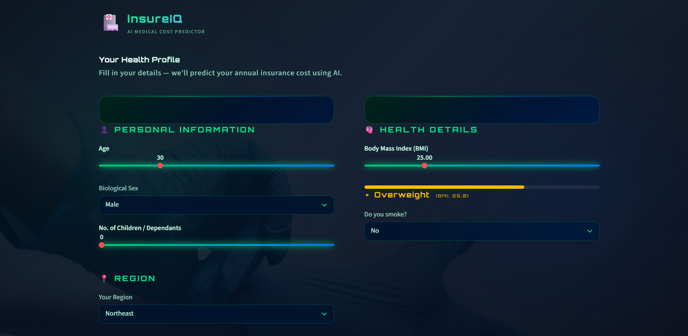
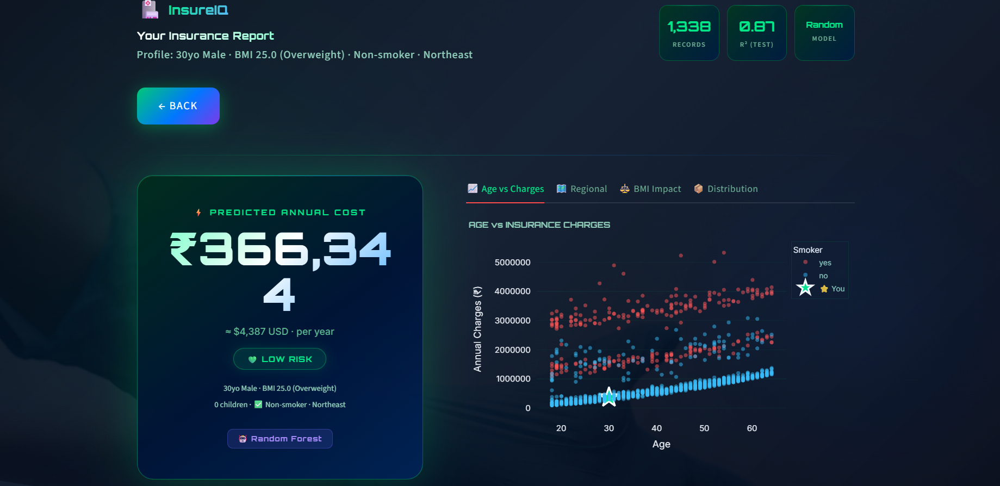
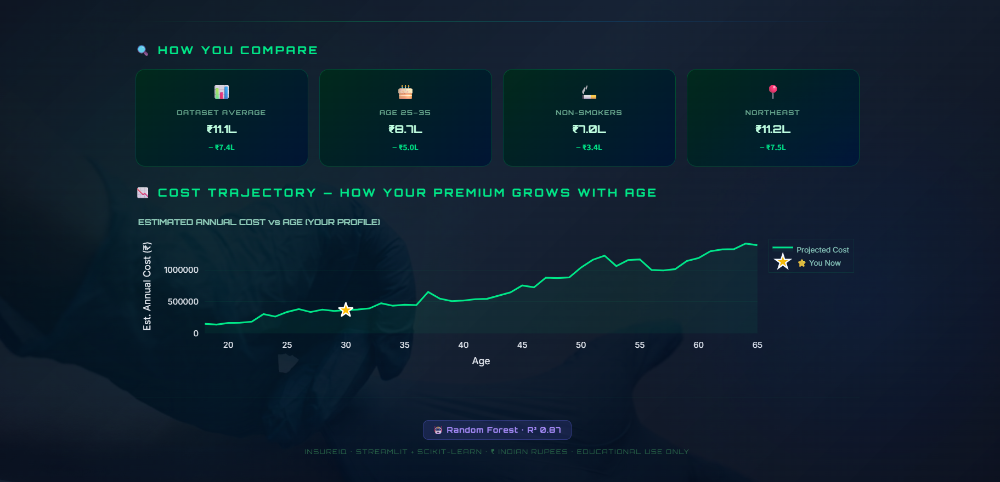

# AI Medical Insurance Cost Predictor

This project predicts medical insurance charges using Machine Learning.

## Model Details

Algorithm Used: Random Forest Regressor
Problem Type: Regression
Target Variable: Medical Insurance Charges

Model Evaluation
Metric	Value
R² Score	~0.87
Mean Absolute Error	~4181

The Random Forest model was selected after comparing multiple regression algorithms for optimal predictive performance.
## 🚀 How to Run

### Step 1 — Install Dependencies

```bash
pip install -r requirements.txt
```

---

### Step 2 — Train the Model (Run Once)

```bash
python model_training.py
```

This will generate:

* `insurance_model.pkl` → trained ML model
* `model_features.pkl` → saved feature structure
* `model_score.json` → evaluation metrics

---

### Step 3 — Start the Streamlit App

```bash
streamlit run app.py
```

---

### Step 4 — Open in Browser

The application will automatically open in your browser.

If it doesn't open, go to:

```
http://localhost:8501
```


## Project Structure
medical-insurance-cost-predictor/
│
├── app.py                    # Streamlit web application
├── model_training.py        # Machine learning training pipeline
├── insurance.csv            # Dataset
├── insurance_model.pkl      # Trained ML model
├── model_features.pkl       # Feature configuration
├── model_score.json         # Model evaluation metrics
├── requirements.txt         # Project dependencies
├── README.md                # Project documentation
└── screenshot/              # Application UI screenshots

## 🛠 Tech Stack

| Layer | Technology |
|------|------------|
| Backend | Python 3.10+, Streamlit |
| ML / Data | Scikit-learn, Pandas, NumPy |
| Data Visualization | Plotly |
| Dataset | Medical Insurance Dataset (`insurance.csv`) |
| Model Persistence | Python `pickle` |
| Development | VS Code |

## Features of the Application

🔍 Predict individual medical insurance costs

📈 Visualize risk factors affecting insurance pricing

📊 Interactive analytics and data visualizations

⚡ Fast predictions using a trained ML model

🌐 User-friendly Streamlit interface

## Application Screenshot

### Dashboard
<p align="center">

</p>

### Prediction Page
<p align="center">

</p>

### Risk Analysis
<p align="center">

</p>